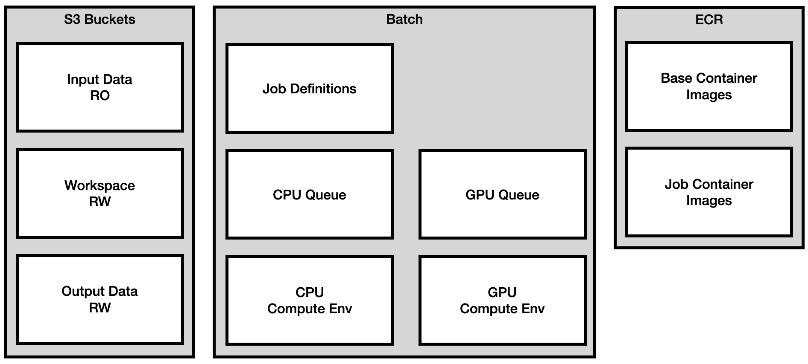
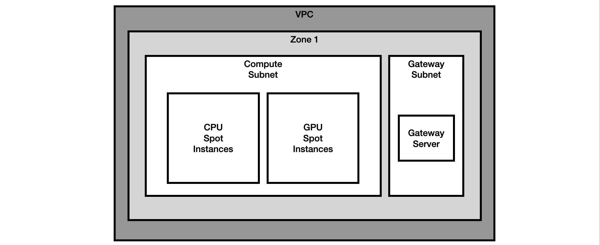

# AWS Batch Cluster

This repository builds an [AWS Batch](https://aws.amazon.com/batch/) cluster. 

There are a lot of things to put in place to get AWS Batch ready to do real work. This project gets you there
by building the necessary core infrastructure (job definitions, queues, compute environments) and supporting 
infrastructure (VPC with subnets and gateways ready to host EC2 spot instances, S3 buckets, ECR repository, 
IAM policies and roles so jobs can access the resources). It also provides some basic tools to submit and query jobs.

The default setup builds a demo or development cluster. This is a minimal setup to test the system. There
are configuration options for more advanced, production ready configurations which are described in the
[Production Cluster](#production-cluster) section below.

The demo cluster uses [docker engine](https://docs.docker.com/engine/install/) to build management containers 
with the necessary thirdparty software (eg. terraform and ansible) and at the correct versions. This works 
well for the demo cluster, but probably wouldn't work for a production cluster

To run the submission tools, you will need a recent python3 installation, and will probably use virtual
environments to install the software and dependencies.

And of course, you also need an aws account with a working configuration for the 
[cli tools](https://docs.aws.amazon.com/cli/latest/userguide/getting-started-quickstart.html).

The [Key Components](#key-components) section below gives an overview of the cluster's key components and
how they work together to run a job.

The [Demo Cluster](#demo-cluster) section describes how to build the demo or development cluster. This
is a simple cluster that is useful to get familiar with the system, but isn't really a production
ready system. It also describes how to define, build and run jobs.

Finally, the [Production Cluster](#production-cluster) section describes how to upgrade the demo
cluster to make it more scalable and resilient for production systems.

## Key Components

The key components of the cluster are shown in the diagram below.

These components are all built by the terraform configurations in this repository; these are the same
for both the demo cluster and any production cluster. See the [AWS Batch](https://aws.amazon.com/batch/)
documentation for details on how they work together.

There are a lot of ways to build and use batch, but the workflow that is setup in this repository
is that each job will have an associated docker container image in ECR that contains
all the software needed to run the job, will load data from an S3 bucket, will use a workspace S3
bucket for intermediate data (optional), and will write results to the output S3 Bucket.

This terraform configurations create the necessary IAM policies and roles for the compute environments to 
have correct access to the buckets, but accessing the buckets is up to the application itself.

The compute environments vary substantially between demo and production environments and are described
in the sections below.

## Demo Cluster

### Overview

The compute environment for the demo cluster is shown below:

The key things to note are:

* runs in single availability zone - not resilient
* all access to S3 and ECR is via a single gateway server - not resilient, not scalable
* compute resources are EC2 SPOT instances

The issues noted above can be fixed with simple configuration variables to be multi-zone and to use
endpoints to access resources. This is all described in the [production cluster](#production-cluster)
section.

### Building the Cluster

The steps to build the cluster are described in the following documents:

* [bootstrapping](docs/00-bootstrapping.md) the environment
* building the [cluster](docs/01-cluster.md) infrastructure
* building the [base containers](docs/02-base-containers.md)

### Creating and Running Jobs

There are a number of things to do to create and run a job. They are described in [this](docs/job-helloworld.md)
document using the `helloworld` job as an example.

## Production Cluster

The default build can be customized by overriding variables in the [variables.tf](01-cluster/cluster/variables.tf) 
file. This is done by creating a `terraform.tfvars` file and setting the values in there. The file
[terraform.tfvars.example](01-cluster/cluster/terraform.tfvars.example) can be used as a starting point
for customizing the build and contains the variables most likely to be customized and an explanation of each.

The variables fall into three categories:

* service endpoints
* multiple availability zones
* user supplied buckets

## Tools

Documentation for the tools can be found [here](docs/tools.md)

