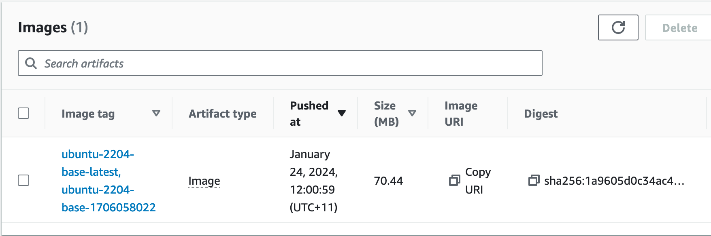

# Base Container Images

The repository has 4 base container images ready to be used. They install some software
specific to their intended use and can be used by job container images as a starting point.

The build scripts and docker files are in the [02-base-containers](../02-base-containers) directory

They all install various bits of thirdparty software and a custom utility script that can
be used to wrap the intended script to run, called `run-wrapper.py`. This can do variable
expansion for the command and it also monitors the resource usage such as cpu and memory
and reports that in the log file for the job. This is useful to tune resource requirements
for the job.

The base containers are:

| Name                   | Description                               |
| ---------------------- | ----------------------------------------- |
| ubuntu-2004-focal-base | Ubuntu 2004 with python3                  |
| ubuntu-2204-jammy-base | Ubuntu 2204 with python3                  |
| torch-cpu-base         | PyTorch 1.11.0 and related software       |
| torch-cuda-base        | PyTorch 1.11.0+cu113 and related software |

## Building the Container Images

There is a `build.sh` script and a `Dockerfile` for each of the base images. Building is as 
simple as:

    $ ./build.sh <project-name> <aws-profile>

The images will be built and pushed to the ECR repository for the project. For example:

