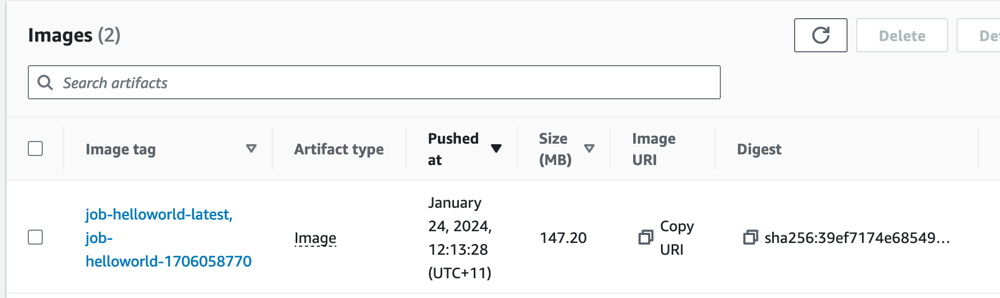

# Helloworld Job

There are four parts to setting up a job:

* job definition in the batch infrastructure
* application source code
* job container in the ECR repository
* submission templates

This document walks through each of these for the `helloworld` job.

## Job Definition

The job definition is built as part of the cluster infrastructure build. It requires cluster admin rights
to create so for the demo, it's been kept it with the cluster terraform files. This does mean the job is split 
across two different locations, but job developers may not have cluster admin rights. 

And example of a job definition file can be see for the [helloworld](../01-cluster/cluster/job_helloworld.tf) 
job terraform file. This creates the job definition and a log group in cloudwatch for the job.

## Application Source Code

The source code for the helloworld application can be found in the [src](../03-jobs/helloworld/src) directory.
In this case it is a single python file, but it could be any collection of software needed to run the job.

The source code for a real example probably isn't with the container, but the container build script
would need a way to access it, for example, by cloning a repository as part of the build.

## Job Container Image

The `Dockerfile` and build script can be found in the [container](../03-jobs/helloworld/container) directory.

To build the container image, run the build script:

    $ ./build.sh <project-name> <aws-profile>

This builds the container image and pushes it to the project ECR repository:

## Submission Templates

The submission scripts are a job template that the `submit.py` tool reads and parses to submit the job
to batch. 

There are 3 templates in the [submit-templates](../03-jobs/helloworld/submit-templates) directory that
show the various options to submit jobs.

## Run a Job

The [submit.py](../99-tools) tool is used to read the submission templates and submit jobs to the cluster.
It is provided as a `pip` installable package. To prepare it for use, from within the [99-tools](../99-tools)
directory, run:

    $ python3 -m venv pyenv
    $ source pyenv/bin/activate
    $ pip install .

Then to submit the job, from the [submit-templates](../03-jobs/helloworld/submit-templates) directory, run,
for example:

    $ submit -p <aws-profile> <project-name> helloworld.yaml

This will submit the job to batch for running.

